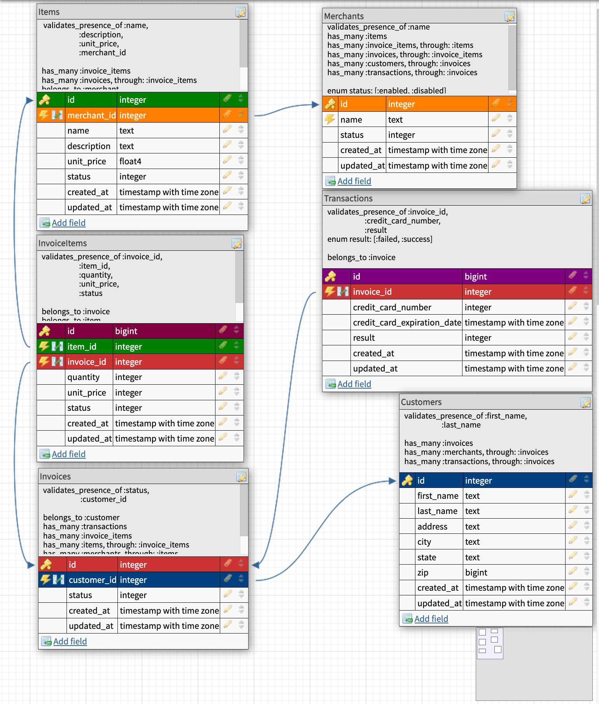

# Bulk Discounts

### Descirption of Project

This project, entitled "Bulk Discounts" is an extention of a previous project named "Little Esty Shop." This is the Turing BE-Mod2, Final Solo Project focusing on designing an e-commerce platform that applies discounts to a specific merchant's items. It's funcitonality would allow merchants as well as admins to manage inventory & fill customers orders. 

This project is a `Ruby on Rails` application, using `PostgreSQL` as the object-relational database management system. This app is live [here](https://little-esty-discounts-akh.herokuapp.com/merchant/1/bulk_discounts) on `H

New concepts learned during the course of this project included: 
- deploying the entire project to Heroku along with the `rake tasks`,
- creating complex `ActiveRecord` queries to the database,
- consuming one `API` to serve data to the site.

### Summary of all Works Completed
Step 1: GitHub & Setup 
Step 2: Heroku Setup 
Step 3: Design the Schema 
Step 4: Create Tables & Associations 
Step 5: User Stories 1 - 8 
Step 6: User Story 9 (API) 
Step 7: Refactor 
Step 8: Final Heroku Deployment 

### Project Schema

### Completed User Stories:
#### 1: Merchant Bulk Discounts Index
As a merchant
When I visit my merchant dashboard
Then I see a link to view all my discounts
When I click this link
Then I am taken to my bulk discounts index page
Where I see all of my bulk discounts including their
percentage discount and quantity thresholds
And each bulk discount listed includes a link to its show page

#### 2: Merchant Bulk Discount Create
As a merchant
When I visit my bulk discounts index
Then I see a link to create a new discount
When I click this link
Then I am taken to a new page where I see a form to add a new bulk discount
When I fill in the form with valid data
Then I am redirected back to the bulk discount index
And I see my new bulk discount listed

#### 3: Merchant Bulk Discount Delete
As a merchant
When I visit my bulk discounts index
Then next to each bulk discount I see a link to delete it
When I click this link
Then I am redirected back to the bulk discounts index page
And I no longer see the discount listed

#### 4: Merchant Bulk Discount Show
As a merchant
When I visit my bulk discount show page
Then I see the bulk discount's quantity threshold and percentage discount

#### 5: Merchant Bulk Discount Edit
As a merchant
When I visit my bulk discount show page
Then I see a link to edit the bulk discount
When I click this link
Then I am taken to a new page with a form to edit the discount
And I see that the discounts current attributes are pre-poluated in the form
When I change any/all of the information and click submit
Then I am redirected to the bulk discount's show page
And I see that the discount's attributes have been updated

#### 6: Merchant Invoice Show Page: Total Revenue and Discounted Revenue
As a merchant
When I visit my merchant invoice show page
Then I see the total revenue for my merchant from this invoice (not including discounts)
And I see the total discounted revenue for my merchant from this invoice which includes bulk discounts in the calculation

#### 7: Merchant Invoice Show Page: Link to applied discounts
As a merchant
When I visit my merchant invoice show page
Next to each invoice item I see a link to the show page for the bulk discount that was applied (if any)

#### 8: Admin Invoice Show Page: Total Revenue and Discounted Revenue
As an admin
When I visit an admin invoice show page
Then I see the total revenue from this invoice (not including discounts)
And I see the total discounted revenue from this invoice which includes bulk discounts in the calculation

#### 9: Holidays API
As a merchant
When I visit the discounts index page
I see a section with a header of "Upcoming Holidays"
In this section the name and date of the next 3 upcoming US holidays are listed.

Use the Next Public Holidays Endpoint in the [Nager.Date API](https://date.nager.at/swagger/index.html)
